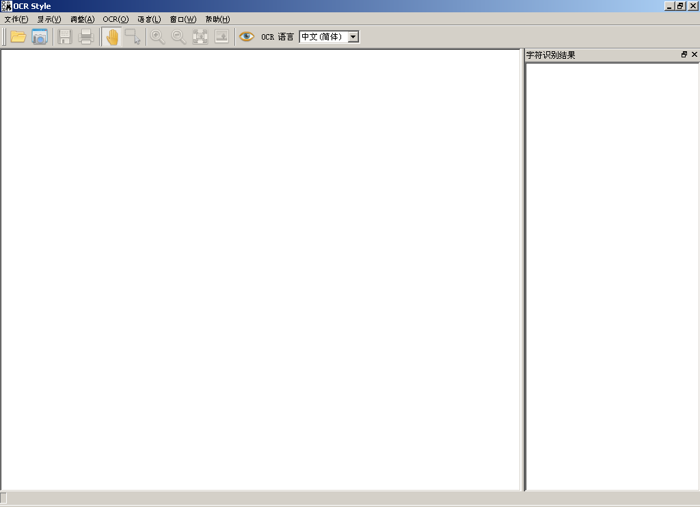
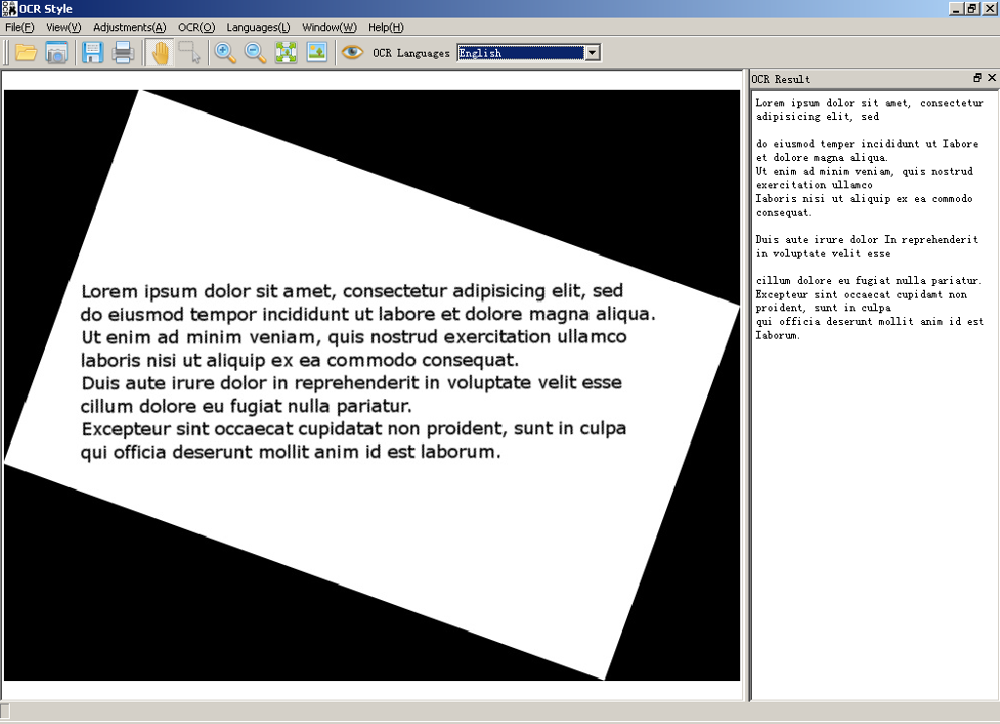
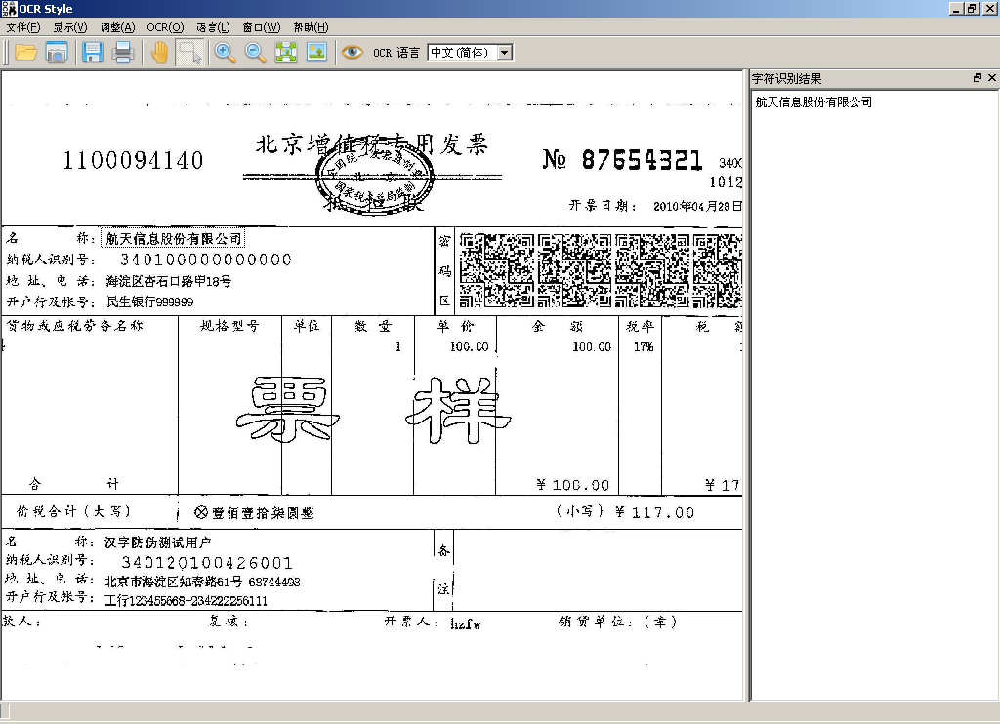

# OCR Style

========
Optical Character Recognition

========
##背景
本程序最初是想用于发票识别的，目前可以通过ocrengine和imageprocess动态库进行二次开发。

##功能
图片识别文字的软件。
支持截图。
支持选择识别的区域。
支持选择识别的语言。
支持倾斜纠正。
支持保存识别的文字。
支持多种语言的识别，内置了中文和英文，可以根据需要下载其它语言。

##截图
###主界面

###英文图片倾斜纠正并识别

###中文发票进行区域选择并识别

